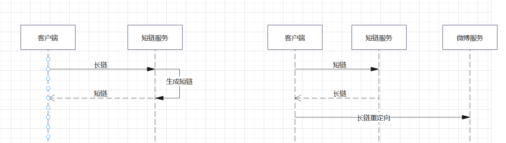

# 需求背景

# 架构设计
短链服务有两个主要职责：
1. 根据长链生成短链
2. 根据短链返回长链


# 数据库设计
```mysql
CREATE TABLE url_map(
    'id' int primary key not null auto_increment,
    short_url varchar(10) default null comment "短链",
    long_url varchar(256) default null comment "长链"
)engine=InnoDB DEFAULT CHARSET=utf8;

```
# 技术栈
springboot + redis + guava
# 技术要点
### 如何生成短链？
1.使用非加密哈希算法MurmurHash生成长链的哈希值
2.用62进制表示哈希值。六十二进制是使用常用的0-9、a-z、A-Z，也就是10个数字 + 26个小写 + 26个大写 = 62位。7位长度62进制可以表示的范围是 62^7 = 3,521,614,606,208 (合计3.5万亿)，完全足够使用。

### 如何判断是否发生 HASH 冲突？

可以使用关系型数据库中的唯一索引来判断，本项目为了提高性能采用的是布隆过滤器来判断是否存在 HASH 冲突。

### 如何处理 HASH 冲突？

如果发生 HASH 冲突，就在生成的字符串后面再随机拼一个字符串。如果还是发生冲突，就再在后面拼接一个字符串。

### 如何解决布隆过滤器误判的情况？

本项目在布隆过滤器之后，还增加了数据库校验。默认布隆过滤器中提示存在的短链地址，都要去数据库中再次检验一遍。